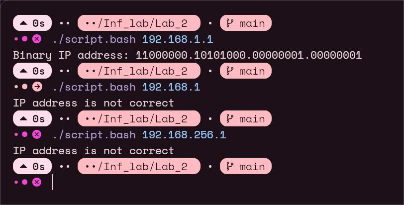

# Лабораторная работа 2

## Описание скрипта
Скрипт преобразует IPv4-адрес из десятичного формата в двоичный


## Основная часть


### 1. Проверка входных данных
Скрипт начинает с проверки корректности формата IP-адреса:

```bash
if ! [[ $ip_address =~ ^([0-9]{1,3}\.){3}[0-9]{1,3}$ ]]; then
  echo "IP address is not correct"
  exit 1
fi
```

Это регулярное выражение проверяет:

	4 группы цифр, разделенных точками
	Каждая группа содержит от 1 до 3 цифр
	

### 2. Разбиение IP-адреса на октеты

IP-адрес разбивается на отдельные октеты:

```bash
octets=( $(echo $ip_address | tr '.' ' ') )
```
Результат сохраняется в массив `octets`.

### 3. Преобразование в двоичный формат

Для каждого октета выполняется:

1.  Проверка диапазона (0-255):

```bash
if [[ $octet > 255 ]]; then
    echo "IP address is not correct"
    exit 1
fi
```
2.  Преобразование в двоичный вид:
    

```bash
binary_octet=$(echo "obase=2; $octet" | bc)
```
3.  Добавление ведущих нулей до 8 бит:
    
```bash
binary_octet=$(printf "%08d" $binary_octet)
```
### 4. Формирование результата

Двоичные октеты объединяются в строку:

```bash
binary_ip="$binary_ip$binary_octet."
```
В конце удаляется лишняя точка:

```bash
binary_ip=${binary_ip%?}
```
## Примеры работы

### Успешное выполнение

**Вход:**

```./script.bash 192.168.1.1```

**Вывод:**

```Binary IP address: 11000000.10101000.00000001.00000001```

### Ошибка в формате

**Вход:**

```./script.bash 192.168.1```

**Вывод:**

```IP address is not correct```

### Ошибка в диапазоне

**Вход:**

```./script.bash 192.168.256.1```

**Вывод:**

```IP address is not correct```


